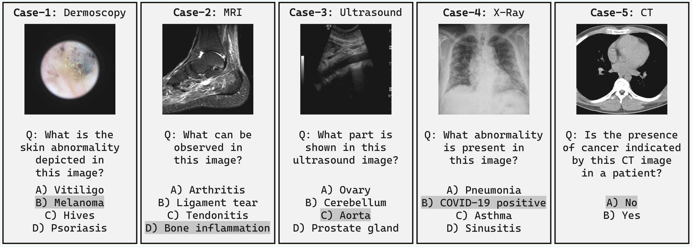
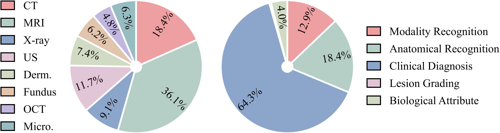

# MergeMedBench: A Benchmark for Evaluating Model Merging Methods for Medical Large Vision-Language Models (LVLMs)

It corresponds to the following paper:

👉 **[Model Merging for Medical LVLMs: A Benchmark and a Winner-Take-All Approach](PASTE_PAPER_LINK_HERE)**

<p align="center">
  
</p>


## 📦 LoRA Checkpoints

We release all fine-tuned LoRA checkpoints included in MergeMedBench.

### 🔹 Qwen3-VL-2B-Instruct

| Name | Modality | Link |
|:------------|:----------|:---------------|
| Qwen3-VL-2B-Instruct-CT-LoRA | CT | [Download](https://huggingface.co/MergeMedBench/Qwen3-VL-2B-Instruct-CT-LoRA) |
| Qwen3-VL-2B-Instruct-MRI-LoRA | MRI | [Download](https://huggingface.co/MergeMedBench/Qwen3-VL-2B-Instruct-MRI-LoRA) |
| Qwen3-VL-2B-Instruct-XRay-LoRA | X-Ray | [Download](https://huggingface.co/MergeMedBench/Qwen3-VL-2B-Instruct-XRay-LoRA) |
| Qwen3-VL-2B-Instruct-Ultrasound-LoRA | Ultrasound | [Download](https://huggingface.co/MergeMedBench/Qwen3-VL-2B-Instruct-Ultrasound-LoRA) |
| Qwen3-VL-2B-Instruct-Dermoscopy-LoRA | Dermoscopy | [Download](https://huggingface.co/MergeMedBench/Qwen3-VL-2B-Instruct-Dermoscopy-LoRA) |
| Qwen3-VL-2B-Instruct-Fundus-LoRA | Fundus Photography | [Download](https://huggingface.co/MergeMedBench/Qwen3-VL-2B-Instruct-Fundus-LoRA) |
| Qwen3-VL-2B-Instruct-OCT-LoRA | OCT | [Download](https://huggingface.co/MergeMedBench/Qwen3-VL-2B-Instruct-OCT-LoRA) |
| Qwen3-VL-2B-Instruct-Microscopy-LoRA | Microscopy | [Download](https://huggingface.co/MergeMedBench/Qwen3-VL-2B-Instruct-Microscopy-LoRA) |


### 🔹 InternVL2-1B

| Name | Modality | Link |
|:------------|:----------|:---------------|
| InternVL2-1B-CT-LoRA | CT | [Download](https://huggingface.co/MergeMedBench/InternVL2-1B-CT-LoRA) |
| InternVL2-1B-MRI-LoRA | MRI | [Download](https://huggingface.co/MergeMedBench/InternVL2-1B-MRI-LoRA) |
| InternVL2-1B-XRay-LoRA | X-Ray | [Download](https://huggingface.co/MergeMedBench/InternVL2-1B-XRay-LoRA) |
| InternVL2-1B-Ultrasound-LoRA | Ultrasound | [Download](https://huggingface.co/MergeMedBench/InternVL2-1B-Ultrasound-LoRA) |
| InternVL2-1B-Dermoscopy-LoRA | Dermoscopy | [Download](https://huggingface.co/MergeMedBench/InternVL2-1B-Dermoscopy-LoRA) |
| InternVL2-1B-Fundus-LoRA | Fundus Photography | [Download](https://huggingface.co/MergeMedBench/InternVL2-1B-Fundus-LoRA) |
| InternVL2-1B-OCT-LoRA | OCT | [Download](https://huggingface.co/MergeMedBench/InternVL2-1B-OCT-LoRA) |
| InternVL2-1B-Microscopy-LoRA | Microscopy | [Download](https://huggingface.co/MergeMedBench/InternVL2-1B-Microscopy-LoRA) |


## 🧪 Evaluation Dataset

The images used in MergeMedBench are sourced from the OmniMedVQA dataset and are not distributed with this repository. Please download the dataset from the official source. We provide the image IDs and corresponding question-answer pairs for all samples used in our evaluation across all modalities:

👉 **[MergeMedBench Evaluation Set](https://huggingface.co/datasets/MergeMedBench/MergeMedBenchTest/tree/main)**

<p align="center">
  
</p>


## 📖 Citation

If you use this benchmark or the released LoRA checkpoints, please cite:

```bibtex
@article{mergemedbench2026,
  title={Model Merging for Medical LVLMs: A Benchmark and a Winner-Take-All Approach},
  year={2026}
}
